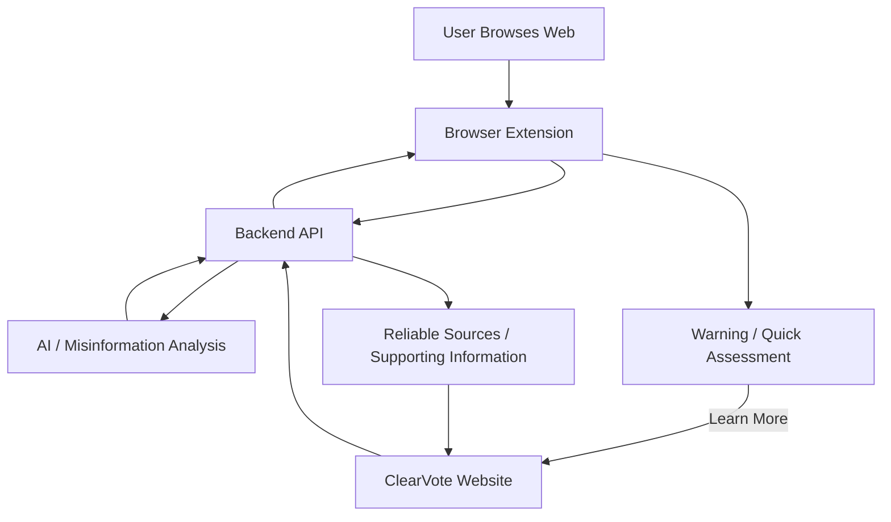

# ClearVote System Architecture

## Overview

ClearVote is made up of four main technical components:

1. **Browser Extension / Frontend**
2. **Backend API**
3. **AI / Misinformation Analysis**
4. **ClearVote Website**

## System Flow

## Component Responsibilities

### Browser Extension / Frontend

* Detects relevant content
* Sends content to the backend
* Displays warnings and quick assessments
* Provides the **Learn More** link

### Backend API

* Connects the frontend, website, and analysis systems
* Sends content for analysis
* Returns results in a consistent format

### AI / Misinformation Analysis

* Evaluates submitted content
* Identifies potentially misleading claims
* Produces assessment results and supporting information

### ClearVote Website

* Displays detailed results
* Explains why content was flagged
* Shows reliable sources and additional context

## Integration Principle

Each component should be built independently but communicate through clearly defined inputs and outputs, primarily through the backend API.

